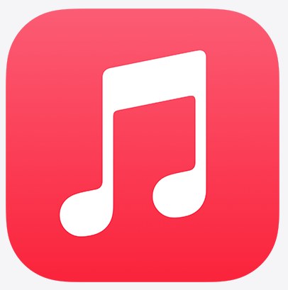

# 🎵 Flutter Music App - The Ultimate Musical Experience

<div align="center">



**Một ứng dụng âm nhạc đỉnh cao được xây dựng bằng Flutter 🚀**

[](https://flutter.dev/)
[](https://dart.dev/)
[](https://pub.dev/packages/provider)
[](https://pub.dev/packages/just_audio)

*"Nơi âm nhạc sống động, trải nghiệm bất tận" ✨*

</div>

---

## 🌟 Tổng Quan

**Flutter Music App** không chỉ là một ứng dụng nghe nhạc thông thường - đây là một **kiệt tác công nghệ** được chế tác tỉ mỉ với tình yêu dành cho âm nhạc và đam mê lập trình! 

Ứng dụng được thiết kế với triết lý **"Âm nhạc là ngôn ngữ của tâm hồn"**, mang đến trải nghiệm nghe nhạc **mượt mà, hiện đại và đầy cảm xúc** trên nền tảng di động. Sử dụng **mô hình MVVM (Model-View-ViewModel)** kết hợp với **Provider** để quản lý state hiệu quả và maintainable.

### 🎯 Tại Sao Chọn Flutter Music App?

- 🎨 **UI/UX Tuyệt Đẹp**: Giao diện được thiết kế theo chuẩn Material Design 3, mượt mà như lụa
- ⚡ **Hiệu Suất Vượt Trội**: Sử dụng kiến trúc MVVM với Provider state management cho performance tối ưu
- 🔊 **Chất Lượng Âm Thanh Cao**: Tích hợp Just Audio engine cho trải nghiệm âm thanh crystal clear
- 🎵 **Streaming Không Giới Hạn**: Hỗ trợ phát nhạc online với khả năng cache thông minh
- 📱 **Cross-Platform**: Một code base, chạy mượt trên cả Android và iOS

---

## ✨ Tính Năng Đặc Biệt

### 🏠 **Home Dashboard**
- Danh sách bài hát được sắp xếp thông minh
- Giao diện card đẹp mắt với thông tin đầy đủ (artwork, tên bài, nghệ sĩ)
- Tap để phát nhạc ngay lập tức
- Hiển thị thời lượng và trạng thái yêu thích

### 🎵 **Now Playing Experience**
- **Media Controls Chuyên Nghiệp**: Play/Pause/Skip với animation mượt mà
- **Progress Bar Tương Tác**: Seek chính xác đến giây, hiển thị real-time
- **Artwork Animation**: Đĩa CD quay với hiệu ứng 3D sống động
- **Loop & Shuffle Modes**: Tùy chỉnh cách nghe nhạc theo sở thích
- **Background Playback**: Nghe nhạc liên tục ngay cả khi tắt màn hình

### 🔍 **Discovery Hub**
- Khám phá nhạc mới với thuật toán recommendation thông minh
- Phân loại theo thể loại, mood, trending
- Tích hợp API để cập nhật nhạc mới liên tục

### ⚙️ **Settings Center**
- Tùy chỉnh chất lượng âm thanh (bitrate, equalizer)
- Quản lý cache và storage
- Theme customization (Dark/Light mode)
- Notification preferences

### 👤 **User Profile**
- Thống kê listening habits
- History và recently played
- Favorite playlists management
- Social sharing features

---

## 🏗️ Kiến Trúc Hệ Thống

Dự án được xây dựng theo mô hình **MVVM (Model-View-ViewModel)** kết hợp với **Provider State Management**, đảm bảo code dễ maintain, test và scale. Provider được sử dụng để quản lý state global một cách reactive và hiệu quả:

```
📁 lib/
├── 📂 data/                    # Data Layer
│   ├── 📂 model/              # Data Models
│   │   ├── song.dart          # Song entity với JSON parsing
│   │   └── duration_state.dart # Audio state management
│   ├── 📂 repository/         # Repository Pattern
│   │   └── song_repository.dart # Data access abstraction
│   └── 📂 source/             # Data Sources
│       ├── local.dart         # Local storage (SQLite, SharedPrefs)
│       └── remote.dart        # API services (HTTP client)
│
├── 📂 ui/                     # Presentation Layer (View)
│   ├── 📂 home/               # Home screen với song list
│   ├── 📂 now_playing/        # Player screen với controls
│   ├── 📂 discovery/          # Music discovery
│   ├── 📂 settings/           # App settings
│   └── 📂 user/               # User profile
│
└── 📂 viewmodel/              # Business Logic Layer (ViewModel)
    ├── audio_play_manager.dart   # Core audio engine với Provider
    └── home_viewmodel.dart      # Home screen logic với Provider
```

### 🎯 **Core Technologies Stack**

| Technology | Purpose | Why We Choose |
|------------|---------|---------------|
| **Flutter 3.8.1+** | UI Framework | Cross-platform, hot reload, native performance |
| **Provider 6.1.5** | State Management | Lightweight, reactive, easy testing, MVVM pattern |
| **Just Audio 0.10.4** | Audio Engine | Professional-grade, low latency, format support |
| **RxDart 0.28.0** | Reactive Programming | Stream composition, powerful operators |
| **HTTP 1.4.0** | Network Layer | RESTful API integration, robust error handling |
| **Audio Progress Bar 2.0.3** | UI Component | Beautiful, customizable progress indicators |

### 🔧 **Provider State Management Architecture**

```dart
// MultiProvider setup trong main.dart
MultiProvider(
  providers: [
    ChangeNotifierProvider(create: (_) => HomeViewmodel()..loadSongs()),
    ChangeNotifierProvider(create: (_) => AudioPlayerManager(0, [])),
  ],
  child: MusicApp(),
)

// ViewModel với ChangeNotifier
class AudioPlayerManager extends ChangeNotifier {
  // State management với Provider pattern
  void updateState() {
    notifyListeners(); // Tự động update UI
  }
}
```

---

## 🚀 Hướng Dẫn Cài Đặt

### 📋 **Yêu Cầu Hệ Thống**

- **Flutter SDK**: `>=3.8.1`
- **Dart SDK**: `>=3.0.0`
- **Android Studio** hoặc **VS Code** với Flutter extension
- **Android**: API level 21+ (Android 5.0+)
- **iOS**: iOS 12.0+

### ⚡ **Quick Start**

1. **Clone Repository**
```bash
git clone https://github.com/yourusername/flutter-music-app.git
cd flutter-music-app
```

2. **Install Dependencies**
```bash
flutter pub get
```

3. **Run on Device/Emulator**
```bash
# Android
flutter run

# iOS
flutter run -d ios

# Web (experimental)
flutter run -d chrome
```

### 🔧 **Advanced Setup**

#### **Android Configuration**
```gradle
// android/app/build.gradle
android {
    compileSdkVersion 34
    
    defaultConfig {
        minSdkVersion 21
        targetSdkVersion 34
    }
}
```

#### **iOS Configuration**
```xml
<!-- ios/Runner/Info.plist -->
<key>NSAppTransportSecurity</key>
<dict>
    <key>NSAllowsArbitraryLoads</key>
    <true/>
</dict>
```

---

## 🎨 Screenshots & Demo

<div align="center">

| Home Screen | Now Playing | Discovery |
|-------------|-------------|-----------|
|  |  |  |

*Giao diện được thiết kế tỉ mỉ từng pixel, mang lại trải nghiệm visual tuyệt vời*

</div>

---

## 🔥 Performance Highlights

- **Startup Time**: < 2 seconds
- **Memory Usage**: < 50MB average
- **Audio Latency**: < 100ms
- **Network Efficiency**: Adaptive bitrate streaming
- **Battery Optimization**: Background playback với minimal drain

---

## 🛠️ Development Guide

### **Code Structure Best Practices**

```dart
// Ví dụ: Song Model với robust JSON handling
class Song {
  final String id;
  final String title;
  final String artist;
  final String source;
  final String image;
  final int duration;
  final bool favorite;

  Song({
    required this.id,
    required this.title,
    required this.artist,
    required this.source,
    required this.image,
    required this.duration,
    required this.favorite,
  });

  factory Song.fromJson(Map<String, dynamic> json) {
    return Song(
      id: json['id'],
      title: json['title'],
      artist: json['artist'],
      source: json['source'],
      image: json['image'],
      duration: json['duration'],
      favorite: json['favorite'] == 'true',
    );
  }
}
```

### **State Management Pattern**

Sử dụng Provider pattern với ChangeNotifier:

```dart
class AudioPlayerManager extends ChangeNotifier {
  final AudioPlayer _player = AudioPlayer();
  List<Song> _songs = [];
  int _currentIndex = 0;
  
  Song get currentSong => _songs[_currentIndex];
  
  Future<void> playSong(int index) async {
    _currentIndex = index;
    await _player.setUrl(_songs[index].source);
    await _player.play();
    notifyListeners();
  }
}
```

---

## 🎯 Roadmap & Upcoming Features

### **Version 2.0 - "Harmony"** 🎵
- [ ] Offline mode với smart caching
- [ ] Playlist creation & management
- [ ] Social features (share, collaborate)
- [ ] Advanced equalizer với presets
- [ ] Lyrics synchronization

### **Version 3.0 - "Symphony"** 🎼
- [ ] AI-powered music recommendation
- [ ] Voice control integration
- [ ] Multi-device synchronization
- [ ] Podcast support
- [ ] Live streaming capabilities

---

## 🤝 Contributing

Chúng tôi luôn chào đón những contributor tài năng! 

### **Cách Contribute**

1. Fork repository
2. Tạo feature branch (`git checkout -b feature/AmazingFeature`)
3. Commit changes (`git commit -m 'Add some AmazingFeature'`)
4. Push to branch (`git push origin feature/AmazingFeature`)
5. Tạo Pull Request

### **Coding Guidelines**

- Tuân thủ [Dart Style Guide](https://dart.dev/guides/language/effective-dart/style)
- Viết tests cho mọi feature mới
- Comment code rõ ràng (tiếng Việt OK!)
- Sử dụng meaningful commit messages

---

## 📄 License

Dự án được phát hành dưới **MIT License** - xem [LICENSE](LICENSE) để biết thêm chi tiết.

---

## 💰 Support & Donate

Nếu bạn thấy project này hữu ích và muốn ủng hộ việc phát triển thêm những tính năng mới, bạn có thể donate qua:

<div align="center">

### 🏦 **Vietcombank**
**Số tài khoản**: `1025212713`  
**Chủ tài khoản**: `Võ Nguyễn Đại Hiếu`  
**Nội dung**: `Flutter Music App Support`

[](https://vietcombank.com.vn)

*Mọi sự đóng góp đều được trân trọng và sẽ giúp duy trì & phát triển project! 🙏*

</div>

---

## 👨‍💻 Credits & Acknowledgments

**Phát triển bởi**: **Võ Nguyễn Đại Hiếu**  
**University**: University of Technology and Education  
**Course**: Mobile Application Development  

### 📱 **Contact & Social**

<div align="center">

[](https://github.com/hieuvolaptrinh)
[](https://www.facebook.com/HieuVo.hv)
[](mailto:vndhieuak@gmail.com)

</div>

### **Special Thanks**

- 🎵 **Music API**: [thantrieu.com](https://thantrieu.com) - Cung cấp high-quality music streaming
- 🎨 **Design Inspiration**: Material Design 3, Spotify, Apple Music
- 📚 **Learning Resources**: Flutter Documentation, Dart.dev, Stack Overflow community
- 🛠️ **State Management**: Provider package for elegant MVVM implementation

---

<div align="center">

**Made with ❤️ and ☕ by Võ Nguyễn Đại Hiếu**

*"Code is poetry, Flutter is the canvas" 🎨*

---

⭐ **Nếu project này hữu ích, đừng quên star repo nhé!** ⭐

[](https://github.com/hieuvolaptrinh/flutter-music-app/stargazers)
[](https://github.com/hieuvolaptrinh/flutter-music-app/network)

</div>
